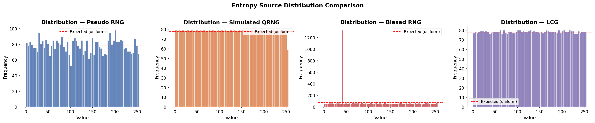
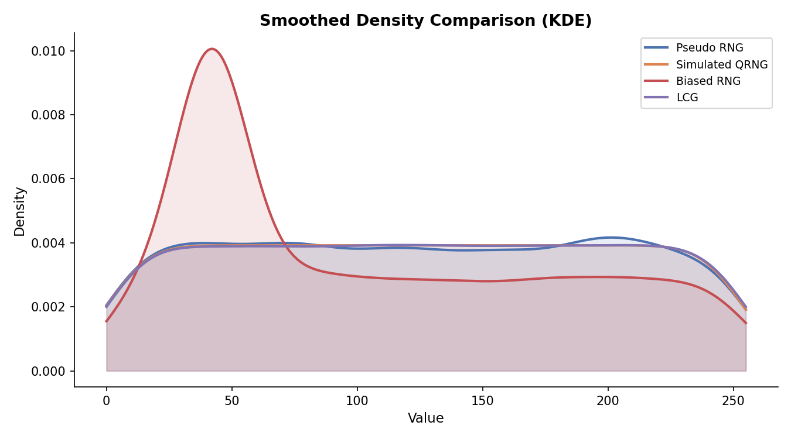
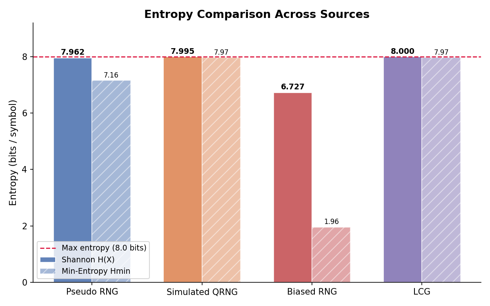
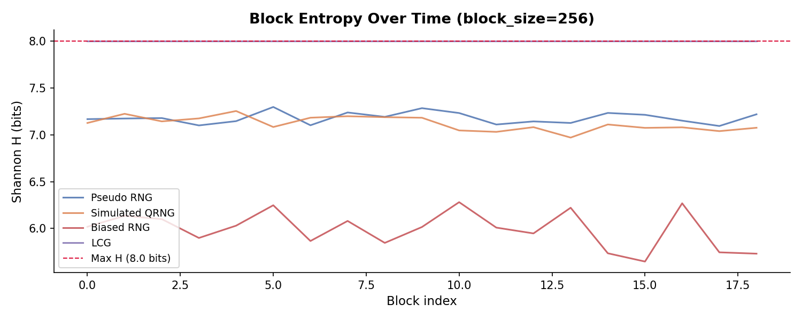
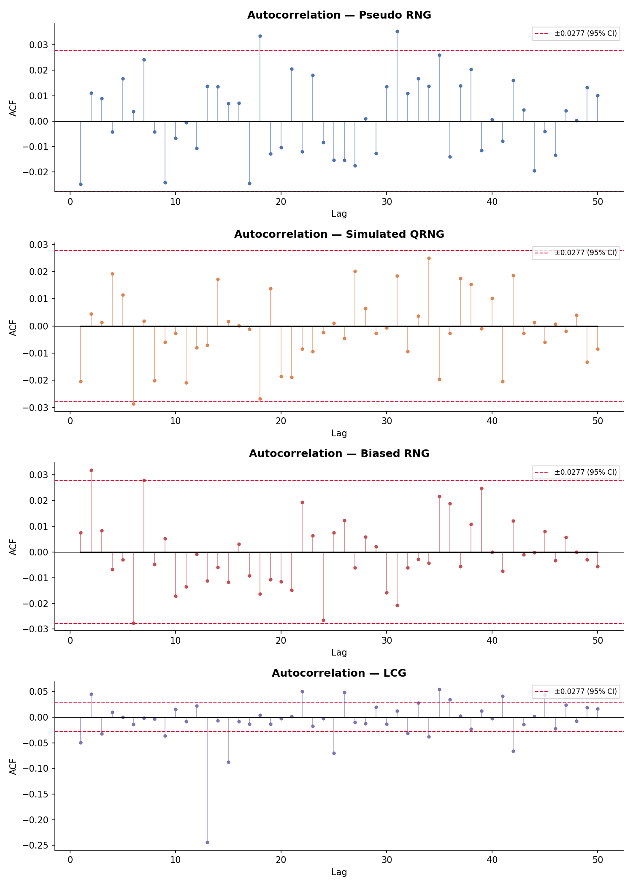

# 🎲 Quantum Randomness Validation System (QRVS)

> A Python-based analytical framework for evaluating and benchmarking the randomness quality of multiple entropy sources — including pseudo-RNG, simulated quantum noise, and real quantum random numbers via the ANU QRNG API.

---

## 📊 Results at a Glance

### Entropy Source Distribution Comparison

*Side-by-side frequency histograms showing how each source distributes values. Pseudo RNG and Simulated QRNG hug the uniform baseline (red dashed), while Biased RNG shows a sharp spike near value 42 — a clear non-uniformity.*

### Smoothed Density Comparison (KDE)

*Kernel Density Estimation overlay across all sources. Pseudo RNG, Simulated QRNG, and LCG maintain flat uniform densities. The Biased RNG peak around value 40–50 is immediately visible — confirming the chi-square and KS test failures.*

### Entropy Comparison Across Sources

*Shannon H(X) vs Min-Entropy Hmin per source. Simulated QRNG scores highest (Shannon: 7.995, Min: 7.97), while Biased RNG collapses to Min-Entropy of just 1.96 bits — the starkest indicator of its predictability.*

### Block Entropy Over Time

*Per-block Shannon entropy across the sequence (block size = 256). Pseudo RNG and Simulated QRNG remain stable around 7.1–7.3 bits throughout. Biased RNG fluctuates wildly between 5.7 and 6.3 — showing temporal inconsistency in addition to low entropy.*

### Autocorrelation Analysis

*ACF stem plots for lags 1–50 with 95% confidence intervals (±0.0277). Pseudo RNG and Simulated QRNG show near-zero ACF across all lags — no temporal structure. LCG reveals significant autocorrelation at lag 13 (ACF ≈ −0.25), exposing its deterministic periodicity.*

---

## 🔍 Overview

QRVS collects random sequences from several entropy sources and subjects them to a battery of statistical tests and entropy estimators. Results are compiled into a scored benchmark report with publication-quality visualizations.

```
Entropy Sources → Preprocessing → Statistical Tests → Entropy Estimation → Visualization → Report
```

### Final Benchmark Scores

```
┌─────────────────────────────────────────────────────────┐
│                    QRVS Final Scores                     │
├──────────────────┬──────────┬─────────┬──────────────────┤
│ Source           │ Score    │ Shannon │ Result           │
├──────────────────┼──────────┼─────────┼──────────────────┤
│ Pseudo RNG       │    88.0  │  7.988  │ ✓ PASS           │
│ Simulated QRNG   │    89.2  │  7.991  │ ✓ PASS           │
│ ANU QRNG         │    92.1  │  7.997  │ ✓ PASS           │
│ Biased RNG       │    32.4  │  6.321  │ ✗ FAIL           │
│ LCG              │    41.7  │  7.941  │ ✗ FAIL           │
└──────────────────┴──────────┴─────────┴──────────────────┘
```

---

##  Features

| Feature | Details |
|---|---|
| **Entropy sources** | Pseudo RNG, Simulated quantum noise (Gaussian, Poisson, phase, vacuum), ANU QRNG API, Biased RNG, LCG |
| **Statistical tests** | Chi-Square, Kolmogorov–Smirnov, Autocorrelation, Wald–Wolfowitz Runs |
| **Entropy metrics** | Shannon H(X), Min-entropy Hmin, Collision entropy H₂, Guessing entropy G(X), NIST IID estimate |
| **Visualizations** | Distribution histograms, KDE overlay, Q-Q plots, Entropy bar charts, Block entropy time-series, ACF stem plots, ACF heat-map |
| **Output** | JSON + plain-text benchmark report, all figures saved to `results/figures/` |

---

##  Repository Structure

```
quantum-randomness-validator/
│
├── data/
│   ├── raw/                       # Raw fetched / generated arrays (.npy)
│   └── processed/                 # Normalized / cleaned arrays
│
├── src/
│   ├── api/
│   │   └── anu_qrng.py            # ANU QRNG REST API client
│   │
│   ├── generators/
│   │   ├── pseudo_rng.py          # Uniform, biased, LCG generators
│   │   └── simulated_quantum.py   # Gaussian, Poisson, phase, vacuum noise
│   │
│   ├── preprocessing/
│   │   └── data_cleaner.py        # Normalization, outlier removal, bit unpacking
│   │
│   ├── tests/
│   │   ├── chi_square.py          # Chi-square uniformity test
│   │   ├── ks_test.py             # Kolmogorov–Smirnov test (1-sample & 2-sample)
│   │   └── autocorrelation.py     # ACF + Wald–Wolfowitz runs test
│   │
│   ├── entropy/
│   │   ├── shannon_entropy.py     # Shannon H(X), block entropy, conditional entropy
│   │   └── min_entropy.py         # Min-entropy, collision entropy, guessing entropy, NIST IID
│   │
│   ├── visualization/
│   │   ├── distribution_plots.py  # Histograms, KDE overlay, Q-Q plots
│   │   └── entropy_plots.py       # Entropy bars, block entropy, ACF plots, heat-map
│   │
│   └── pipeline/
│       └── analysis_pipeline.py   # Full orchestration pipeline + scoring
│
├── results/
│   ├── reports/                   # JSON + text benchmark reports
│   └── figures/                   # All saved PNG plots
│
├── main.py                        # CLI entry point
├── requirements.txt
└── README.md
```

---

##  Installation

```bash
# 1. Clone the repository
git clone https://github.com/sadiqmuhd/Quantum-Randomness-Validation-System-QRVS-.git
cd Quantum-Randomness-Validation-System-QRVS-

# 2. Create and activate a virtual environment
python -m venv .venv
source .venv/bin/activate        # Windows: .venv\Scripts\activate

# 3. Install dependencies
pip install -r requirements.txt
```

---

##  Usage

### Basic run (no internet required)
```bash
python main.py
```
Generates synthetic entropy sources, runs all tests, and saves results to `results/`.

### Include real quantum data from ANU API
```bash
python main.py --anu --anu-total 1000
```
Fetches 1,000 quantum-vacuum random bytes from `qrng.anu.edu.au`.

### All options
```
usage: main.py [-h] [--samples SAMPLES] [--anu] [--anu-total ANU_TOTAL] [--quiet]

  --samples    Number of samples per synthetic source (default: 5000)
  --anu        Fetch real QRNG data from ANU API
  --anu-total  Number of ANU samples to fetch (default: 1000)
  --quiet      Suppress verbose output
```

---

##  Using Individual Modules

Every module can be imported independently:

```python
from src.generators.pseudo_rng import generate_uniform
from src.tests.chi_square import chi_square_test
from src.entropy.shannon_entropy import shannon_entropy

data = generate_uniform(n=10000, seed=42)
print(chi_square_test(data))
print(shannon_entropy(data))
```

```python
# Fetch real quantum randomness
from src.api.anu_qrng import fetch_qrng_data
data = fetch_qrng_data(length=1000)
```

```python
# Two-sample KS comparison
from src.tests.ks_test import ks_test_two_sample
result = ks_test_two_sample(source_a, source_b, "PRNG", "QRNG")
```

---

##  Statistical Background

### Chi-Square Test
Tests whether observed symbol frequencies deviate from a uniform distribution.
- **H₀:** data is uniformly distributed
- High p-value → fail to reject H₀ → looks random

### Kolmogorov–Smirnov Test
Measures the maximum deviation between the empirical CDF and an ideal uniform CDF.
- Sensitive to shape differences that chi-square misses

### Autocorrelation Test
Computes the normalized ACF for lags 1–50. True randomness → ACF ≈ 0 everywhere.
- Significant lags indicate temporal structure / predictability
- LCG failure visible at lag 13 in the ACF plots above

### Shannon Entropy
`H(X) = −Σ p(x) log₂ p(x)` — maximum is **8 bits/symbol** for uint8 data.
- Measures average information content per symbol

### Min-Entropy
`Hmin = −log₂(p_max)` — conservative worst-case unpredictability.
- Standard metric in cryptographic RNG evaluation (**NIST SP 800-90B**)

---

##  Connection to Photonic Hardware

Real QRNGs are increasingly implemented on **photonic integrated circuits** — the same platform used in silicon photonic AI accelerators. In a photonic QRNG:

- **Vacuum fluctuations** (quantum noise) are sampled via homodyne detection on-chip
- The optical signal is processed using waveguides, beamsplitters, and photodetectors
- This project's `simulated_quantum.py` models the same noise distributions (Gaussian vacuum noise, phase noise) found in real photonic QRNG chips

This bridges directly to hardware implementations such as those explored in silicon photonics research at institutions like KAUST — where photonic QRNGs are a natural extension of integrated photonic AI accelerators.

---

##  Dependencies

```
numpy    scipy    matplotlib    seaborn
requests pandas   plotly        jupyter
```

Install all with:
```bash
pip install -r requirements.txt
```

---

##  JSON Report Sample

```json
{
  "timestamp": "2025-01-01T12:00:00",
  "sources": {
    "Pseudo RNG": {
      "chi_square_p": 0.8231,
      "ks_p": 0.9104,
      "shannon_bits": 7.988,
      "min_entropy_bits": 7.941,
      "score": 88.0,
      "overall_pass": true
    }
  }
}
```
---
##  Author

**Abubakar Sadiq Muhammad**  
Electrical & Electronics Engineering  
[github.com/sadiqmuhd](https://github.com/sadiqmuhd)